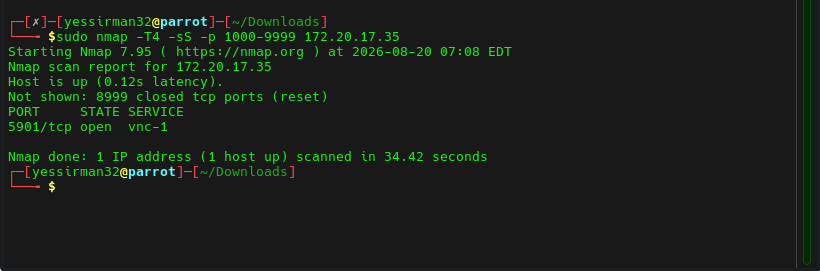
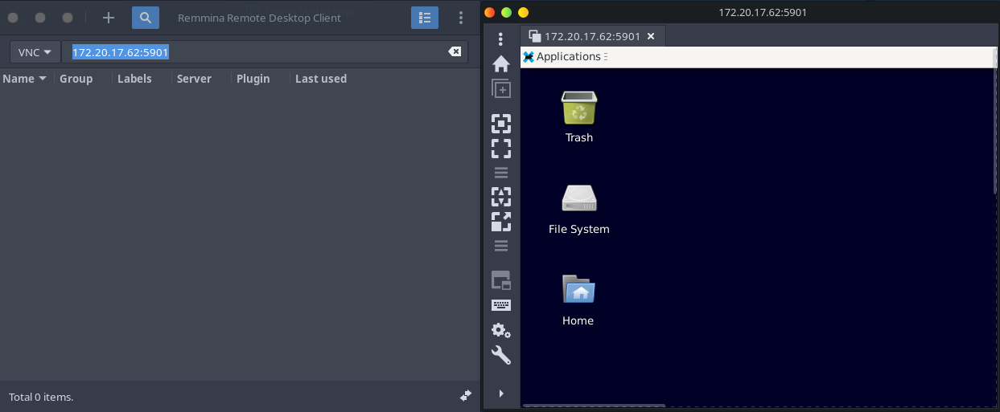
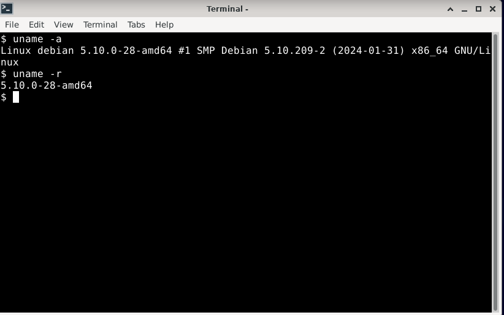
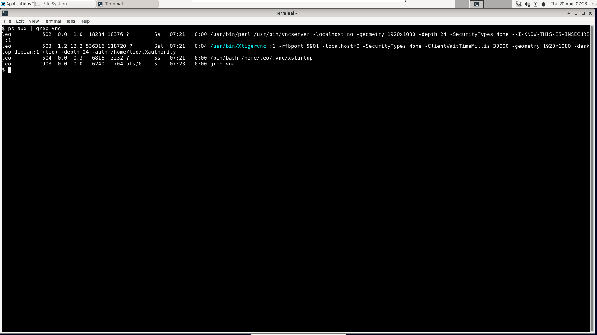
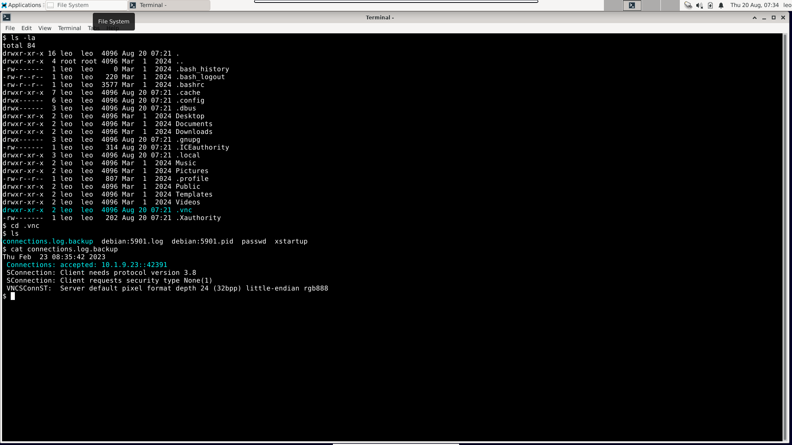

## Executive Summary
A VNC misconfiguration allowed access to a remote desktop without a password. This revealed a previous connection to the server.

## Introduction
VNC (Virtual Network Computing) allows remote access to a system which allows for the transmission of images, mouse and keyboard inputs between two computers over the internet. 

Target: 172.20.17.35
Engagement: Hackviser "Tiger" Warmup

## Objective
Use VNC to establish a remote connection to the desktop, then further enumerate the desktop from its shell.

## Scope
The scope of this engagement is only the target machine. This is a grey-box engagement.

Information given:
Target IP address
VNC is running on the target machine
The port VNC was running on was a 4-digit number

## Methodology
nmap was used to find which port VNC was running on, and remmina was used to establish the remote connection.

## Findings
We first ran nmap on the target machine, using the given information to narrow the search

This reveals the port used for VNC. We can now open remmina and establish the remote VNC connection. (The machine changed IP addresses during this section, its new IP address is 172.20.17.62)

As per lab requirements, we now determined the username tied to this machine and the linux kernel version

We then checked which VNC program was running. Based on the findings, the user knew the configuration was insecure and decided to use it anyway. The program used was xtigervnc

We then checked for any previous connections, and there was indeed one previous connection. This may indicate compromise.

Severity assessment: 🟠 **High**. It's not critical, as there was no indication of root compromise

## Remediation
Fix the VNC configuration to ensure unauthorized access prohibition.

Take a memory snapshot along with its digest using SHA-2 or SHA-3.
Disconnect the computer from the internet until remediation is complete.
Use the memory snapshot to look for malicious processes and eradicate them.

Check the filesystem to ensure no malicious activity remains.
If possible, restore the system to a snapshot taken before the connection was established.

## Conclusion
A misconfigured VNC server allowed for remote connection without authentication. The logs revealed a previous connection to the server. Overall risk was 🟠 **High**.
